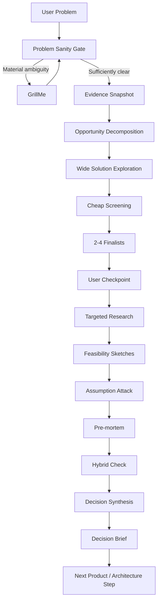

# Problem to Solution

`problem-to-solution` is the Agent Toolkit capability for moving from a real problem to a small set of researched, decision-ready solution directions.

It is deliberately not a generic brainstorming prompt and not a final architecture generator.

Its job is to prevent two common failures:

1. jumping from a problem directly to the first plausible solution
2. spending large amounts of research and design effort before the useful solution space has been narrowed

## When to use it

Use Problem to Solution when you have a problem, pain point, inefficiency, opportunity, or proposed product direction and want to understand the strongest ways it could be solved.

Typical examples:
- exploring a new product
- challenging a proposed product idea
- finding alternatives to an architecture-heavy solution
- comparing digital, operational, process, hardware, or hybrid approaches
- deciding whether a new system should exist at all
- narrowing several possible approaches before deep research

Do not use it when:
- the user already has a fully decided implementation and only needs coding
- the problem itself has not been established at all
- the task is a small deterministic engineering change
- the user needs only one factual answer

## Mental model

Problem to Solution separates **breadth** from **depth**.

First it explores the solution space cheaply. Only after weak or redundant directions are eliminated does it spend serious research effort.



The number of finalists is not fixed. Two to four is a normal range, not an algorithmic requirement.

## GrillMe integration

GrillMe is **conditional**.

Problem to Solution should not automatically interview the user every time.

It invokes GrillMe only when missing intent, ambiguity, or an unsupported preferred solution would materially affect the exploration.

### Normal clarification

```text
$grill-me
```

Use when important context is missing and there is no special time constraint.

### Fast clarification

```text
$grill-me fast
```

Use when the user is time-constrained.

GrillMe focuses on the highest-impact unanswered decisions rather than attempting broad coverage.

### Explicit question budget

```text
$grill-me 5
```

Use when the user explicitly limits the interview.

The number is a maximum, not a target.

### Challenge mode

```text
$grill-me hard
```

Use when the user already has a concrete solution and that preference risks collapsing the exploration too early.

Example:

```text
"We should build this as microservices."
```

Problem to Solution should treat microservices as a candidate or constraint to examine, not automatically as the destination.

### Deep clarification

```text
$grill-me deep
```

Use only when the user explicitly wants exhaustive clarification or when the decision is sufficiently high-stakes to justify a deeper interview.

### What GrillMe should not do here

GrillMe does not:
- create the solution candidates
- choose the winner
- perform the research
- create final architecture
- own Problem to Solution state

It only resolves or challenges material ambiguity and returns control to the workflow.

## Thinking procedure

### 1. Understand the problem

The capability first determines whether the input is actually a problem.

Inputs may instead be:
- a symptom
- a proposed solution
- an aspiration
- insufficiently defined

For example:

```text
"We need microservices."
```

is not yet a useful problem statement.

The underlying problem might involve deployment independence, scaling, ownership boundaries, reliability, or something else entirely.

### 2. Separate evidence from belief

The capability keeps these concepts distinct:

```text
FACT
ASSUMPTION
UNKNOWN
CONSTRAINT
DECISION
```

Something plausible is not automatically a fact.

### 3. Decompose the opportunity

Before proposing implementations, it identifies what parts of the problem actually create pain or value loss.

This reduces the chance of solving a symptom.

### 4. Explore by mechanism

The system deliberately looks for genuinely different mechanisms.

A useful solution space might contain:
- process change
- operational change
- simplification
- software
- automation
- hardware
- incentive change
- governance/policy
- platform
- hybrid
- improved status quo

These are lenses, not mandatory categories.

The model is free to choose the mechanisms relevant to the problem.

### 5. Screen cheaply

Early candidates receive lightweight evaluation.

This phase should not produce:
- detailed architecture
- stack comparisons
- infrastructure diagrams
- implementation plans
- exhaustive market research

The goal is to remove obviously poor directions before spending expensive reasoning and research.

### 6. Preserve the trade space

The shortlist should contain candidates that represent meaningfully different tradeoffs.

It should not contain:

```text
Option A: React app
Option B: Next.js app
Option C: Vue app
```

when the real question is whether software is even the best mechanism.

### 7. Research selectively

Deep research starts only after narrowing.

Research lanes are selected dynamically:

```text
USER / PROBLEM
MARKET / ALTERNATIVES
BUSINESS / VIABILITY
TECHNICAL / FEASIBILITY
RISK / GOVERNANCE
DELIVERY / OPERATIONS
```

Not every problem needs every lane.

The workflow researches questions capable of changing the decision.

### 8. Sketch feasibility, not final architecture

Architecture at this point exists to answer:

```text
Can this realistically work?
What are the expensive parts?
What dependencies exist?
What operational constraints appear?
How could it evolve?
```

It does not answer every implementation question.

### 9. Attack assumptions

Every finalist should expose the assumptions capable of killing it.

The system then asks:

```text
What is the cheapest experiment that could prove this assumption wrong?
```

This is more useful than immediately building a large prototype.

### 10. Run a pre-mortem

The workflow assumes each finalist failed and asks why.

This provides a separate failure-oriented perspective after the generative phase.

### 11. Hybridize carefully

Hybrid solutions are considered only after candidates have been independently evaluated.

Otherwise the process tends to create an "everything solution" that inherits every cost and dependency.

A hybrid receives the same evaluation as any other candidate.

### 12. Synthesize the decision

The final Decision Brief makes evidence and uncertainty visible.

A recommendation is allowed when evidence materially supports one.

When evidence does not support a winner, the correct output is:

```text
"We cannot decide yet. This is the evidence that would change the decision."
```

rather than manufactured certainty.

## Core design principle

The capability follows:

```text
cheap breadth
    ↓
narrow
    ↓
expensive depth
```

not:

```text
idea
    ↓
deep research immediately
    ↓
architecture
    ↓
hope it was the right idea
```

## What it produces

The capability uses three human-readable artifacts.

### Problem Brief

Captures:
- the problem
- affected parties
- desired outcome
- evidence
- assumptions
- unknowns
- constraints
- status quo
- cost of doing nothing

### Solution Option

Captures for each serious candidate:
- mechanism
- problem coverage
- dependencies
- assumptions
- adoption burden
- cost/complexity drivers
- principal failure mode
- confidence
- cheapest useful experiment

### Decision Brief

Captures:
- finalists
- evidence
- tradeoffs
- critical assumptions
- risks
- feasibility
- adoption
- confidence
- eliminated options
- unresolved evidence
- recommendation when justified
- next action

## Relationship to other Agent Toolkit capabilities

```text
GrillMe
  resolves ambiguity and challenges assumptions
       |
       v
Problem to Solution
  explores and narrows solution directions
       |
       v
Architect
  designs the selected direction in detail
       |
       v
Implementation workflows
  build and validate it
```

Problem to Solution should not absorb those capabilities.

Each remains independently reusable.

## Human usage guidance

A strong starting request looks like:

```text
Problem:
<what is happening today>

Affected people:
<who experiences it>

Why it matters:
<cost, pain, risk, or missed value>

Known constraints:
<anything already fixed>
```

But users do not need to fill out a formal template before starting.

When something important is missing, the workflow can invoke GrillMe to obtain only the clarification that matters.

## Maturity

Start this capability as `experimental`.

Promote it only after evals and real problem explorations show that:
- solution directions are actually diverse
- user-proposed solutions are challenged when appropriate
- GrillMe is invoked selectively rather than constantly
- research happens after narrowing
- architecture stays proportional
- the workflow knows when not to force a recommendation
