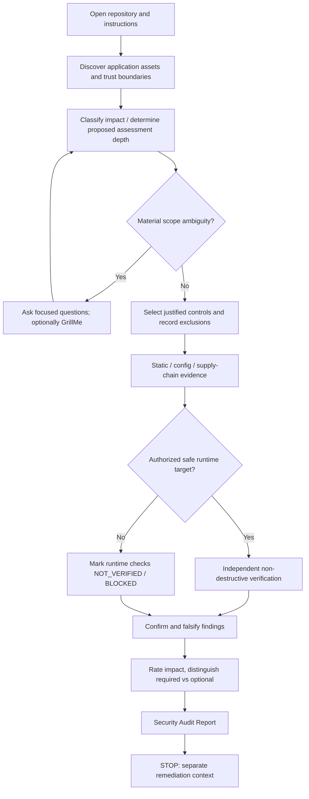

# Security Audit — human guide

## Purpose

`security-audit` is a **read-only, risk-calibrated application-security assessor** for an existing codebase. It discovers implemented protections, evaluates which controls are justified by the project's actual threat and obligations, independently verifies what it can, and gives a simple evidence-backed report.

Its goal is not maximum control count. A lightweight personal application and a high-impact financial system need different security assurance, but neither may treat a broken essential control as acceptable.

This is **not** a fixer, vulnerability bounty hunter, certification authority, blanket regulatory-compliance checker, or performance tester.

## When to invoke

Use it near feature/release completion, before significant exposure of data or users, after impactful auth/security changes, after architectural boundary changes, or when you want an independent technical assessment.

You may request:

```text
$security-audit
$security-audit sanity
$security-audit standard
$security-audit deep
```

`standard` is the default. Depth is distinct from impact tier. A low-impact app may warrant a deep review of a particular feature; a critical-impact service remains critical even if only a sanity audit was performed.

## Procedure at a glance



## Two independent classification systems

**Application impact** describes consequences if security fails:

| Tier | Meaning |
|---|---|
| LOW | Small exposure and limited consequences with no meaningful sensitive assets |
| MODERATE | Ordinary accounts, personal data, operational risk |
| HIGH | Valuable data/commerce, multiple tenants, privileged or high-impact business paths |
| CRITICAL | Potential severe financial, safety, health or systemic harm |

The tier is evidence-based; never derived solely from the app's title or popularity. Financial transactions do not automatically imply card-data scope; a fitness app may still process sensitive information.

**Assessment depth** determines verification effort:

| Depth | What changes |
|---|---|
| SANITY | Targeted baseline inspection and high-value safety checks; explicitly limited assurance |
| STANDARD | Applicable controls with independent runtime evidence where authorized |
| DEEP | More threat-driven, negative, differential and high-risk boundary verification |

Depth does not introduce arbitrary test counts. Deep does not override legal, tool, or environmental limitations.

## Example report states

A project might have `COMPLETE` implementation for JWT issuance, but `NOT_VERIFIED` for actual signature checking if no suitable boundary evidence exists. A middleware implementation might be `PARTIAL` if an administrative route bypasses it. A properly protected control is `COMPLETE` and `VERIFIED` only at the assessed boundary.

The auditor separates:

- **Applicability**: `REQUIRED`, `RECOMMENDED`, `NOT_APPLICABLE`, `UNDETERMINED`.
- **Implementation**: `COMPLETE`, `PARTIAL`, `ABSENT`, `UNKNOWN`.
- **Verification**: `VERIFIED`, `FAILED`, `PARTIAL`, `NOT_VERIFIED`, `INCONCLUSIVE`, `BLOCKED`, `NOT_APPLICABLE`.
- **Finding severity**: `CRITICAL`, `HIGH`, `MEDIUM`, `LOW`, `INFORMATIONAL`.

A green suite does not mean an application is secure. A scanner alert does not automatically prove an exploit. The report links its conclusions to the evidence actually gathered.

## How controls are selected

The skill uses a universal exposure-aware baseline and adds domains selectively: authentication, access controls, tenant isolation, APIs, sessions, sensitive data, cryptography, secrets, file upload, payment/transaction integrity, cloud/IaC, supply chain, event processing, AI tools/MCP, and relevant regulatory obligations.

The key test for inclusion is **does the system's actual assets, attack paths, or binding requirements justify this control?** Otherwise the auditor should be willing to say no change is needed.

For example, no SSO in a simple standalone project may be perfectly adequate. But an API that exposes another user's private record remains a real defect regardless of tier.

## Active testing authorization

The auditor may inspect code and configuration without changing them. Browser and HTTP tests are performed only against explicitly authorized local/test assets with appropriate test identities; mutating, broad or availability-impacting probes require additional approval. If the runtime target isn't provably in scope, the auditor stops at passive evidence and marks the verification gap.

There is no production penetration-testing mode hidden behind `deep`.

## Regulation and sector-aware review

The `knowledge/security/regulatory-applicability.md` reference is loaded only when material to the project. It covers screening questions and official links for HIPAA, GDPR, India's DPDP framework, PCI DSS, NIST identity assurance and organizational programs such as SOC 2 and ISO/IEC 27001.

The agent must not automatically prescribe HIPAA for a fitness app, PCI DSS for every money-related app, or high-assurance MFA for every user. Regulations are independently scoped; technical code audits cannot issue formal compliance judgments.

## Separation from remediation

```text
SECURITY AUDIT
  read project -> select requirements -> inspect -> verify -> report
                                                        |
                                                        v
                                                       STOP

NEW IMPLEMENTATION CONTEXT (authorized separately)
  review findings independently -> design fix -> TDD -> test
                                                        |
                                                        v
FRESH SECURITY AUDIT
  verify affected properties again
```

An independent `agents/security-auditor` identity is optional and useful only if the harness provides an independent agent context. The skill itself is the source of procedure. No vendor-specific browser behavior is embedded.

## Report contract

The general report stays approachable:

1. Project name, assessment tier, depth, outcome and scope.
2. Existing security controls with implementation and verification states.
3. Confirmed defects ranked by context-dependent severity.
4. Required corrections distinct from optional improvements and unnecessary features.
5. Untested material areas, uncertainties and environment limitations.
6. One smallest defensible next action and offer to explain findings.

For investigators, an optional restricted appendix contains redacted commands, code paths, timestamps, and observed outcomes, never credentials or sensitive customer data.

Outcomes: `ACCEPTABLE_WITHIN_ASSESSED_SCOPE`, `REMEDIATION_REQUIRED`, `INSUFFICIENT_EVIDENCE`, `SCOPE_UNRESOLVED`. An acceptable outcome **never** means “unhackable” or “certified.”

## Artifacts

```text
skills/security-audit/SKILL.md                 procedure
skills/security-audit/references/              conditional verification mechanics
knowledge/security/                            reusable assurance + regulatory knowledge
agents/security-auditor/AGENT.md               optional independent read-only delegate
evals/security-audit/cases.yaml                behavioral scenarios
templates/SECURITY-AUDIT-REPORT.md              output structure
docs/skills/security-audit.md                  this human guide
```

No new hooks, scanning scripts, workflow or adapters are needed for v1. Only add reusable deterministic tooling when observed eval failures justify it.

## Maturity and limitations

Ship as `experimental`. Promotion requires executing evals using an agent runtime and validating findings against deliberately safe, known-vulnerable and known-safe fixtures; YAML syntax checks alone cannot prove behavior. Human specialist review remains necessary for high-consequence systems and legal compliance decisions.
