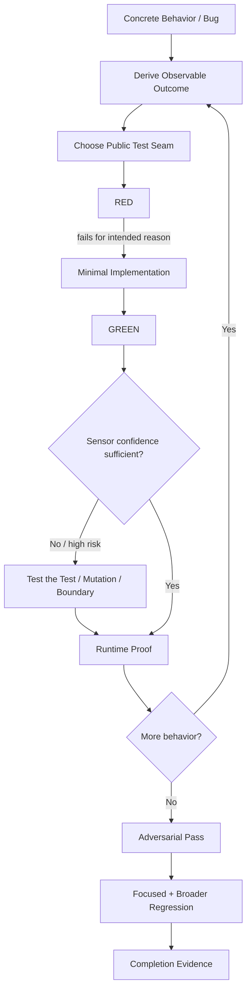

# TDD

`TDD` is Agent Toolkit's test-driven development capability.

It is not a skill for generating a large unit-test suite after implementation. It develops behavior through executable evidence and then independently challenges that evidence.

## Why this skill exists

Coding agents can produce plausible implementations and plausible tests at the same time.

That creates a dangerous loop:

```text
agent writes implementation
        |
        v
agent writes tests based on that implementation
        |
        v
tests agree with implementation
        |
        v
"everything passes"
```

A green suite can still be weak if:
- assertions mirror the implementation
- mocks predetermine the result
- only implementation details are tested
- the real runtime was never exercised
- edge/failure behavior was never challenged
- coverage is high but meaningful defects would survive

TDD treats tests as **sensors**. A sensor is valuable only if it can detect the failures that matter.

## Mental model



The capability has three evidence layers:

```text
1. DEVELOPMENT PROOF
   fast red -> green behavior loop

2. RUNTIME PROOF
   actual UI/API/CLI/event/library behavior

3. ADVERSARIAL PROOF
   risk-proportional attempt to break the feature
```

A feature may use different seams for each layer.

## Invocation

### Standard

```text
$tdd
```

Default for ordinary feature/bug work.

### Quick

```text
$tdd quick
```

For low-risk or time-constrained changes.

Quick still requires meaningful RED, GREEN, and runtime evidence. It reduces breadth of falsification.

### Hard

```text
$tdd hard
```

For high-risk features or when the user explicitly wants the system attacked.

Typical HARD candidates:
- authentication
- authorization
- payments
- financial calculations
- migrations
- deletion
- security boundaries
- concurrency
- idempotency
- irreversible state changes
- sensitive-data handling

HARD does not mean "write 50 tests." It means search more aggressively for ways the feature can be wrong.

## What TDD is not

TDD is not:
- coverage maximization
- test-case generation
- browser testing only
- unit testing only
- penetration testing
- final code review
- architecture redesign
- an excuse to test trivial wiring

It is a development procedure for behavior that has an independently knowable expected outcome.

## The inner loop

### 1. Pick one behavior

Take one externally meaningful vertical slice.

Avoid:

```text
write all tests
-> write all implementation
```

Prefer:

```text
one behavior
-> RED
-> GREEN
-> learn
-> next behavior
```

The first slice can act as a tracer bullet through the system.

### 2. Establish the oracle

Before the assertion exists, determine why the expected result is correct.

Good sources:
- acceptance criteria
- domain/business rule
- protocol
- known worked example
- trusted fixture
- existing contract

Bad source:

```text
"the implementation returns 42, therefore the test expects 42"
```

This is the central protection against an agent writing tests that merely agree with itself.

### 3. Choose the development seam

Use the narrowest public seam that gives fast meaningful feedback.

That seam may be:
- exported domain interface
- service API
- HTTP contract
- CLI command
- rendered user interaction
- event boundary

Do not bind the suite to private implementation structure.

### 4. RED must be real

The test must fail because the behavior is missing or incorrect.

A broken fixture or wrong import does not count.

If it is already green, determine why before writing production code.

### 5. GREEN minimally

Implement enough to satisfy the current behavior.

Do not anticipate five later cases and build speculative abstraction.

### 6. Test the test

For important behavior, ask:

```text
Would this sensor notice if the code were meaningfully wrong?
```

Ways to answer:
- remove/bypass the behavior locally
- move a boundary value
- introduce a controlled mutation
- use a configured mutation-testing tool
- compare with an independent expected result

Mutation testing is particularly useful when coverage is high but trust is low.

## Runtime proof

The real runtime layer is where TDD verifies that the implementation works through the strongest practical external surface.

```text
Web UI       -> running app + browser automation
HTTP API     -> real HTTP request
CLI          -> invoke executable
Event system -> trigger public input, observe public result
Library      -> exported consumer interface
```

For web interfaces, browser automation should behave like a user:
- semantic controls
- roles
- labels
- visible text
- navigation
- visible outcome

It should not "verify the UI" by calling component internals.

Browser/runtime verification is not necessarily the first red-green loop. End-to-end tests can be too slow for that role.

The preferred pattern is:

```text
fast inner behavioral seam
        |
        v
runtime proof at meaningful boundaries
```

## Depth model

### QUICK

Goal: establish basic confidence cheaply.

Typical coverage:
- primary success path
- one meaningful negative path
- runtime proof
- focused regression

### STANDARD

Goal: ordinary production confidence.

The model selects relevant:
- success cases
- invalid input
- boundaries
- state transitions
- retries/duplicates
- dependency failure
- persistence consistency
- runtime behavior
- nearby regressions

### HARD

Goal: falsify the feature.

Before execution, create a small failure/threat matrix.

Potential lenses:
- boundaries
- malformed input
- interruption
- stale state
- replay/retry
- concurrency
- dependency failure
- authorization
- tampering/injection
- partial persistence
- invalid transitions
- locale/timezone/Unicode
- runtime/UX interruption
- abuse of valid operations

Only relevant lenses are selected.

## Test plan / ledger

Normal sessions can track active cases in context.

For HARD or a large multi-surface feature, use `templates/TEST-PLAN.md`.

The ledger prevents the agent from forgetting what has been tested after multiple failures/fixes.

States:

```text
PLANNED
RUNNING
PASS
FAIL
BLOCKED
SKIPPED
```

It is not a requirement to design every test before implementation. The red-green loop remains vertical.

## Relationship to coverage

Coverage can reveal unexecuted code.

It cannot prove:
- assertions are meaningful
- the test oracle is correct
- runtime integration works
- failure behavior is safe

Therefore TDD may report coverage, but it must not use a coverage target as the primary proof of correctness.

## Mutation testing

Mutation testing intentionally changes production behavior and checks whether tests detect the change.

Conceptually:

```text
production code
     |
     v
meaningful mutation
     |
     +---- test fails ----> sensor killed mutation
     |
     +---- tests pass ----> sensor may be weak
```

Use mutation testing selectively around changed/high-risk logic.

A high mutation score is not itself the goal. The goal is confidence that important defects are detectable.

## Adversarial testing

HARD mode is deliberately more hostile than normal acceptance testing.

For a registration feature it may investigate:
- valid registration
- duplicate identity
- validation boundaries
- repeated submit
- refresh/interruption
- direct API validation bypass
- authorization/state assumptions
- dependency failure
- unusual Unicode/normalization
- persistence consistency

The exact cases are derived from the feature's risks rather than copied from a universal checklist.

## Security boundary

Security-oriented probes are legitimate only inside authorized development/test scope.

HARD must never mean:
- attack production
- damage shared data
- exploit unrelated systems
- bypass environment safety controls

Prefer a non-destructive probe that proves a weakness safely.

TDD is not a full penetration-testing methodology.

## Failure handling

When TDD finds a bug:
1. preserve a reproduction/sensor
2. fix through red-green when in scope
3. verify the failed case
4. rerun affected regression checks

If the defect requires a different product decision, architecture, authorization model, migration, or major scope expansion, TDD reports `ESCALATE`.

It does not quietly redesign the feature.

## Completion

A useful final report distinguishes:

```text
IMPLEMENTED
TESTED
RUNTIME_VERIFIED
ADVERSARIAL_VERIFIED
BLOCKED
ESCALATE
```

This matters because:

```text
unit tests passed
```

and:

```text
feature observed working in the real runtime and survived the requested adversarial depth
```

are not equivalent claims.

## Relationship to other Agent Toolkit capabilities

```text
Intent / Spec
      |
      v
TDD
build + prove behavior
      |
      v
Code Review
review final diff / standards / intent
```

TDD owns development evidence.

Code Review remains an independent final review rather than being absorbed into TDD.

## Design principles

1. Tests are sensors, not proof by themselves.
2. Never let the implementation author its own truth.
3. Use behavior-facing seams.
4. Keep the inner loop fast.
5. Verify the actual runtime separately.
6. Let risk determine adversarial depth.
7. Try to falsify high-risk behavior.
8. Use coverage as information, not a correctness certificate.
9. Preserve failures as regression sensors.
10. Escalate scope-changing discoveries instead of silently expanding work.
